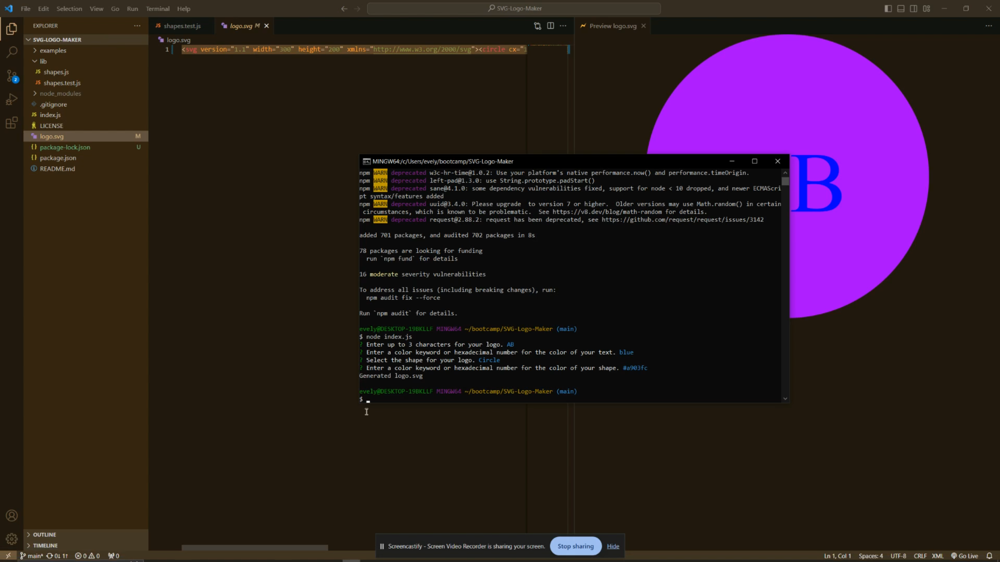
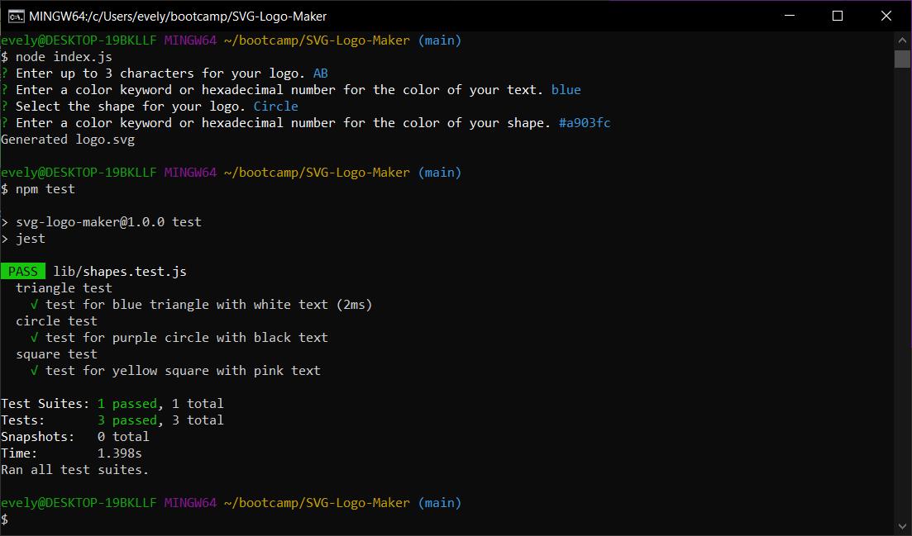

# SVG-Logo-Generator

## Description
    
This applications generates simple SVG logos based on user input. Using nodeJS, users can start the generator from the command line and answer prompts to get a customized SVG file. These logos can be used for projects and saves the user from having to pay a graphic designer.

When starting projects or creating brand identities, it is important to have a logo. A logo is a visual representation of your project, and it will make you and your brand more memorable to others who may use or contribute to your project in the future.

Through making this application, I learned how SVG files are formatted and how to customize the shapes and colors for use with this generator. This is also the first project that I have successfully written unit tests for, which is an important feature of professional software projects.
    
## Table of Contents
    
- [Installation](#installation)
- [Usage](#usage)
- [Screenshots](#screenshots)
- [Contributing](#contributing)
- [License](#license)
- [Tests](#tests)
- [Questions](#questions)
    
## Installation
    
Install the latest version of NodeJS.
Download this repo onto your local computer.
Navigate to the file directory and run "npm i" to install the necessary packages.
    
## Usage
    
After downloading this repo onto your local computer, navigate to these files using your terminal.
Run node index.js to start the generator.
Answer the prompts, hitting enter to move to the next question and using the arrow keys to navigate lists when necessary.
The text on the logo must be 3 characters or less, and the colors must be standard color keywords or hexadecimal values proceeded by a #.
After answering all the prompts with acceptable answers, a "logo.svg" file will be created in the directory.
If any answers are not within accepted parameters, you will recieve an error message and the generator will restart.

### Screenshots

Click the following image to watch a tutorial video on how to use the generator.

Here is a screenshot example of what your terminal should look like after installing the necessary package and filling out the generator's prompts:

Example logo generated with this application:

## Contributing

- Contributors: [eaeidsath](github.com/eaeidsath)
- Credits: Constructor class structures in the shapes.js file were referenced with help from from [stephen-scheiman](https://github.com/stephen-scheiman)'s [repo](https://github.com/stephen-scheiman/SVGMaker)
- Contribution instructions: This project is not looking for contributions at this time.
    
## License

The following license is being used for this project: MIT License.
    
## Tests

Please refer to the shapes.test.js file in the lib folder to see and run tests

## Questions

Please direct questions to [eaeidsath](github.com/eaeidsath) or email your questions to evelyneidsath@gmail.com.